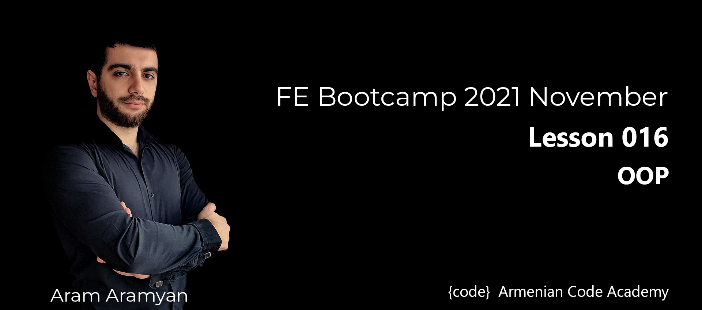

# Classes

### CoffeeShop

**Properties:**

* name: a string (basically, of the shop)
* menu: an array of items (of object type), with each item containing the item (name of the item), type
(whether food or a drink) and price.
* orders: an empty array

**Methods:**

* addOrder: adds the name of the item to the end of the orders array if it exists on the menu.
Otherwise, return "This item is currently unavailable!"
* fulfillOrder: if the orders array is not empty, return "The {item} is ready!". If the orders array is
empty, return "All orders have been fulfilled!"
* listOrders: returns the list of orders taken, otherwise, an empty array.
* dueAmount: returns the total amount due for the orders taken.
* cheapestItem: returns the name of the cheapest item on the menu.
* drinksOnly: returns only the item names of type drink from the menu.
* foodOnly: returns only the item names of type food from the menu.
**IMPORTANT**: Orders are fulfilled in a FIFO (first-in, first-out) order.

[**SOLUTION**](coffeeShop.js)
___

### Shiritori
**This challenge is an English twist on the Japanese word game Shiritori. The basic premise is to follow two
rules:**
* First character of next word must match last character of previous word.
* The word must not have already been said.

**Below is an example of a Shiritori game:**

```js
["word", "dowry", "yodel", "leader", "righteous", "serpent"]; // valid!
["motive", "beach"]; // invalid! - beach should start with "e"
["hive", "eh", "hive"]; // invalid! - "hive" has already been said
```

**Write a Shiritori class that has two instance properties:**
* words: an array of words already said.
* game_over: a boolean that is true if the game is over.


**Methods:**
* play: a method that takes in a word as an argument and checks if it is valid (the word should follow
  rules #1 and #2 above).
  * If it is valid, it adds the word to the words array, and returns the words array.
  * If it is invalid (either rule is broken), it returns "game over" and sets the game_over boolean to
  true.
  * restart: a method that sets the words array to an empty one [] and sets the game_over boolean
  to false. It should return "game restarted".

**IMPORTANT** Words cannot have already been said.
* The play method should not add an invalid word to the words array.
* You don't need to worry about capitalization or white spaces for the inputs for the play method. There
will only be single inputs for the play method.

[**SOLUTION**](shiritori.js)
___

### Author and Book

**Create an Author class and a Book class.**\
\
**Author should have:**
* **fields**
  * name
  * email
  * gender
* **methods**
  * getters for fields
  * toString()

**Book should have:**
* **fields**
  * title
  * author(Author)
  * price
  * quantity
* **methods**
  * getters for fields
  * setters for fields
  * getProfit() - which calculates the profit from the book based on the price and quantity.
  * toString()

**Example:**
```js
let author1 = new Author("J. K. Rowling", "abc@gmail.com", "fEmaLe");

console.log(author1.gender); // female
console.log(author1.name); // J. K. Rowling
console.log(author1.toString()); // Ms. J. K. Rowling

author.name = 12; // throws error
```
[**SOLUTION**](authorAndBoook.js)
___

### Account

**Create an Account class. Account should have:**
* fields
  * id
  * name
  * balance
* getters for fields
* setters - for name and balance
* credit(amount) - which should add amount to balance and return the updated balance.
* debit(amount) - which should subtract the amount from the balance, if amount is less than the balance, otherwise output “Amount exceeded balance.”
* transferTo(anotherAccount, amount) - which should subtract the amount from the account balance and add it to the given anotherAccount and return the updated balance, if amount is less than the balance, otherwise output “Amount exceeded balance.”
* **static method:** identifyAccounts(accountFirst, accountSecond) - which gets two accounts and identifies if they are the same or not comparing all fields.
* toString()

**Example:**

```js
let savingAcc = new Account("Saving account", 2000);
let cardAcc = new Account("Card account", 1000);

console.log(savingAcc); // Account { id: 0, _name: 'Saving account', _balance: 2000 }
console.log(cardAcc); // Account { id: 1, _name: 'Card account', _balance: 1000 }
console.log(savingAcc.balance);     // 2000
console.log(savingAcc.credit(400)); // 2400
console.log(savingAcc.balance);     // 2400
console.log(savingAcc.debit(9000)); //6600
console.log(savingAcc.transferTo(cardAcc, 1000)); // 1400
console.log(savingAcc.balance); // 1400
console.log(cardAcc.balance);   // 2000

let anotherAcc = savingAcc;

console.log(Account.identifyAccounts(savingAcc, anotherAcc)); // true
console.log(Account.identifyAccounts(savingAcc, cardAcc)); // false
console.log(savingAcc.toString()); // Saving account's account balance is $1400.
```

[**SOLUTION**](account.js)
___

### Person and Student

**Write classes: Person class and Student class. Person should have:**
* **fields**
  * firstName
  * lastName
  * gender
  * age
* **methods**
  * getters for fields
  * setters for fields
  * toString()

```js
let user1 = new Person("Name", "Surname", "female", 23);

console.log(user1.toString()); // Name Surname, 23 years old.
```

**Student is inherited from Person. It should have**

* **fields**
  * year
  * fee
  * program (array of { programName, grade })
* **methods**
  * getters for fields
  * setters for fields
  * passExam (programName, grade)
  * isAllPassed()
  * toString()

**Student should contain the data about its programs and exams.**
* passExam will update that data, so if student passed all the exams(grade is great or equal to 50), its year should be increased by one.
* It should have a method isAllPassed().

**Example of program array:**

```js
[
    { programName: "math", grade: 10 },
    { programName: "english", grade: undefined },
];
```

[**SOLUTION**](personAndStudent.js)
